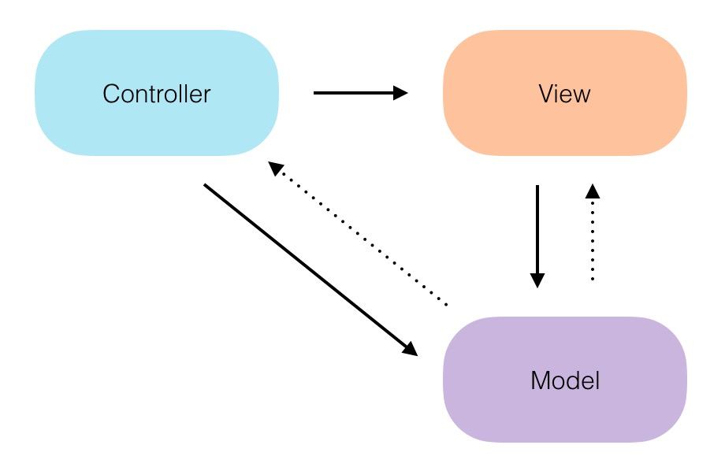
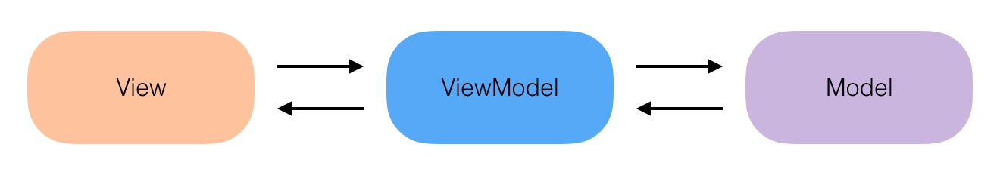
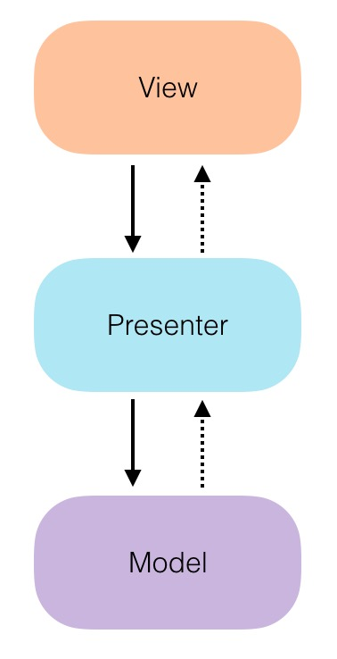

#深入浅出 MVC、MVVM、MVP

对于绝大多数开发者来说，对于选择程序的架构，并没有太多的考虑。一方面是业务变化太快，怎么快，怎么来；另一方面，程序架构一般由团队的核心开发来选择，其他开发者可能会处于云里雾里的状态。本文会详细说明，并有代码参考，教你彻底认清 MVC、MVVM、MVP 的相关知识，希望对大家有用吧！

阅读之前请谨记

* 架构来源于业务，并没有好坏之分。好的架构是在业务、成本、时间之间取得一个完美的平衡
* 希望读者有自己的思考，具有怀疑和批判精神，千万不要相信本文的观点

### MVC
MVC 全名是 Model View Controller，顾名思义，Controller 作为控制器，通过用户输入，控制视图的展示，还可以通过 Model 层的数据组件获取数据，进而改变 View 层的展示，其结构图如下



* Controller
	* 用户动作映射成模型更新
	* 选择响应的视图
* View
	* 获取模型数据
	* 模型展示、更新
	* 收集用户行为，发送给控制器
* Model
	* 封装应用程序状态
	* 响应状态查询
	* 通知视图更新

这里将 Controller、View 放在同一级别，主要是为了说明其调用关系，Controller 对 View 是单向调用，Controller 和 View 对 Model 的调用也是单向的，以实箭头表示。Model 将数据传递给 Controller 或者是 View，传递的方式可以是调用的时候返回，也可以是以回调接口的方式传递，这里用虚箭头表示。

MVC 和 MVVM、MVP 一样，只是一种设计典范，有多种实现形式，例如 ASP.NET MVC 中，控制器（Controller）只是充当了一个 router 的作用，根据用户的请求，返回不同的页面（View），每一个页面调用 db 对象获取数据（Model），展示到页面中。在 JSP 中，控制器是 servlet，视图是 jsp 页面，模型是 bean 对象和 db。

在 Android 中，MVC 又各表示什么呢？Activity 属于控制器，它接收了所有的用户输入请求；layout.xml 等各种界面布局属于视图；各种 bean、repository 等属于模型。不过在 Android 中，也可以把 Activity 也看作视图，它响应用户的输入，从模型层获取数据，进而控制视图的显示与隐藏，主要原因是 xml 没有自处理的能力，只能靠 Activity 来控制，这样就只能把 Activity 和 xml 等都归属于视图，类似在 iOS 中 ViewController 的作用。

在 Android 中使用 MVC 模式，正是因为 Controller 和 View 不清不楚的关系，很容易就写出万能的 Activity 类，业务越复杂，代码量越膨胀，动不动就是上千行。在 iOS 中也一样，iOS 中直接将 View 和 Controller 合成了一个，名字就叫 ViewController。

很多文章会说 MVC 中的 Model 层不能解耦，个人觉得是一种错误的解释。MVC 的出现正是为了将用户输入、视图显示、业务逻辑分离，实现解耦。之所以会给大家留下 Model 层不能和 View、Controller 解耦的现状，其实是因为并没有将 Model 层抽象出来，Model 层属于 Controller、View 的下层，可以以接口的形式来给出，这样接口和实现即可分离，为何不能解耦？

下面将以一个 Android 的代码示例来说明 MVC 的使用。

#### View
#####activity\_home.xml
```
<?xml version="1.0" encoding="utf-8"?>
<LinearLayout xmlns:android="http://schemas.android.com/apk/res/android"
                android:layout_width="match_parent"
                android:layout_height="match_parent"
                android:background="@color/background"
                android:orientation="vertical">

    <RelativeLayout
        android:id="@+id/toolbar"
        android:layout_width="match_parent"
        android:layout_height="@dimen/toolbar_height"
        android:layout_alignParentTop="true"
        android:background="@color/base_color">

        <ImageView
            android:id="@+id/btn_back"
            android:layout_width="wrap_content"
            android:layout_height="match_parent"
            android:layout_centerVertical="true"
            android:paddingLeft="16dp"
            android:paddingRight="16dp"
            android:src="@drawable/selector_button_title_back"/>

        <TextView
            android:layout_width="wrap_content"
            android:layout_height="wrap_content"
            android:layout_centerInParent="true"
            android:text="@string/app_name"
            android:textColor="@color/white"
            android:textSize="18sp"/>
    </RelativeLayout>

    <ListView
        android:id="@+id/list"
        android:layout_width="match_parent"
        android:layout_height="0dp"
        android:layout_weight="1"
        android:groupIndicator="@android:color/transparent"/>

</LinearLayout>
```
这里包含一个标题栏，一个列表。列表的展示如下
#####activity\_home_item.xml
```
<?xml version="1.0" encoding="utf-8"?>
<RelativeLayout xmlns:android="http://schemas.android.com/apk/res/android"
                android:layout_width="match_parent"
                android:layout_height="72dp"
                android:background="@color/white"
                android:minHeight="72dp"
                android:orientation="vertical">

    <ImageView
        android:id="@+id/iv_icon"
        android:layout_width="20dp"
        android:layout_height="20dp"
        android:layout_centerVertical="true"
        android:layout_marginEnd="12dp"
        android:layout_marginLeft="16dp"
        android:layout_marginRight="12dp"
        android:layout_marginStart="16dp"
        android:background="@mipmap/icon_note"/>

    <TextView
        android:id="@+id/tv_item_title"
        android:layout_width="match_parent"
        android:layout_height="wrap_content"
        android:layout_centerVertical="true"
        android:layout_toEndOf="@+id/iv_icon"
        android:layout_toRightOf="@+id/iv_icon"
        android:textColor="@color/text_grey"
        android:textSize="18sp"/>

</RelativeLayout>
```

####Controller (View)
#####HomeActivity.java
```
public class HomeActivity extends AppCompatActivity {

    private ListView mList;
    private HomeListAdapter mListAdapter;

    private TaskRepository mRepository;
    private BaseScheduler mScheduler;
    private BaseThread mMainThread;

    @Override
    public void onCreate(Bundle savedInstanceState) {
        requestWindowFeature(Window.FEATURE_NO_TITLE);
        super.onCreate(savedInstanceState);
        setContentView(R.layout.activity_home);
        mList = (ListView)findViewById(R.id.list);

        mListAdapter = new HomeListAdapter(this);
        mList.setAdapter(mListAdapter);

        mRepository = TaskRepository.getInstance(
                Injection.provideLocalProxy(),
                Injection.provideRemoteProxy());
        mScheduler = ThreadPoolScheduler.getInstance();
        mMainThread = new HandlerThread();
    }

    @Override
    public void onResume() {
        super.onResume();
        initPage();
    }

    private void initPage() {
        mScheduler.execute(new Runnable() {
            @Override
            public void run() {
                List<Task> tasks = mRepository.getTasks();
                onTasksLoaded(tasks);

                tasks = mRepository.refreshTasks();
                onTasksLoaded(tasks);
            }
        });
    }

    private void onTasksLoaded(final List<Task> tasks) {
        if (tasks != null) {
            mMainThread.post(new Runnable() {
                @Override
                public void run() {
                    mListAdapter.setTasks(tasks);
                }
            });
        }
    }
}
```
这里直接使用 TaskRepository 获取数据，获取到之后，设置给 list 的 adapter 去展示。先调用 getTasks 获取本地数据，通知界面更新之后，再调用 refreshTasks 获取服务端数据来做刷新。HomeListAdapter 的代码就不展示出来了。

####Model
#####TaskRepository.java
```
public class TaskRepository implements Repository {

    private static TaskRepository sInstance;

    public static TaskRepository getInstance() {
        if (sInstance == null) {
            synchronized (TaskRepository.class) {
                if (sInstance == null) {
                    sInstance = new TaskRepository();
                }
            }
        }
        return sInstance;
    }

    public static TaskRepository getInstance(LocalProxy localProxy, RemoteProxy remoteProxy) {
        TaskRepository taskRepository = getInstance();
        taskRepository.setLocalProxy(localProxy);
        taskRepository.setRemoteProxy(remoteProxy);
        return taskRepository;
    }

    private LocalProxy mLocalProxy;
    private RemoteProxy mRemoteProxy;

    private TaskRepository() {
    }

    public void setLocalProxy(LocalProxy localProxy) {
        mLocalProxy = localProxy;
    }

    public LocalProxy getLocalProxy() {
        return mLocalProxy;
    }

    public RemoteProxy getRemoteProxy() {
        return mRemoteProxy;
    }

    public void setRemoteProxy(RemoteProxy remoteProxy) {
        mRemoteProxy = remoteProxy;
    }

    @Override
    public List<Task> getTasks() {
        return mLocalProxy.getAll();
    }

    @Override
    public List<Task> refreshTasks() {
        return mRemoteProxy.getAllTask();
    }
}
```

这里可以看到 TaskRepository 实现了 Repository 接口，定义如下

```
public interface Repository {

    List<Task> getTasks();

    List<Task> refreshTasks();
}
```
Model 层可以使用接口来抽象，达到解耦的目的。
####小结
* 对于复杂度不高的业务，使用 MVC，代码会比较少，比较直接，也能快速实现
* 对于没有太多合作的业务来说，可以使用 MVC，可以由同一人来实现 View 和 Controller 部分。

### MVVM
MVVM 全名是 Model View ViewModel，其本质是在 View 和 Model 之间加入了一层中间层，将 Model 表示为一个可展示的对象，其结构图如下


* View
	* 用户动作映射成模型更新
	* 选择响应的视图
	* 获取模型数据
	* 模型展示、更新
* Model
	* 封装应用程序状态
	* 响应状态查询
	* 通知视图更新
* ViewModel
	* 将 Model 层数据适配为 View 层所需要的数据 

相对于 MVC 模式，View 层包含了 MVC 中 View、Controller 的职责，Model 的职责病没有发生变化，ViewModel 可以看做是一个适配器，将 Model 层的数据适配成 View 需要展示的数据。

MVVM 是一种设计范例，它也有多种实现方式，业内最多的实现方式是以 data binding 的形式去实现，而且在该设计范例中，更强调数据绑定的作用。例如在 ASP.NET 中最早就可以将一个数据源绑定到一个控件上。

MVVM 在 Android 中是如何实现的呢？谷歌官方实现了 data binding 的框架，下面我们来看看是如何实现的。

####build.gradle
```
android {

    dataBinding {
        enabled = true
    }
}
```
在 gradle 的默认设置中加入 data binding 的支持。

####View
#####activity\_home_item.xml
```
<?xml version="1.0" encoding="utf-8"?>
<layout xmlns:android="http://schemas.android.com/apk/res/android">
    <data>
        <variable name="task" type="com.android.mvp.data.bean.Task" />
    </data>
    
		 ...
		 
        <TextView
            android:id="@+id/tv_item_title"
            android:layout_width="match_parent"
            android:layout_height="wrap_content"
            android:layout_centerVertical="true"
            android:layout_toEndOf="@+id/iv_icon"
            android:layout_toRightOf="@+id/iv_icon"
            android:textColor="@color/text_grey"
            android:textSize="18sp"
            android:text="@{task.title}"/>

    </RelativeLayout>
</layout>
```
相对于 MVC 中的 activity\_home_item.xml，这里增加了一个 data 节点，用来声明 Task 对象，将 TextView 的显示字段直接绑定到 Task 对象的 title 字段上。这里省略了一些与上文中重复的内容，下同。我们来看一下具体在 HomeListAdapter 中是如何完成数据绑定的。
#####HomeListAdapter.java
```
@Override
public View getView(int position, View convertView, ViewGroup parent) {
    ActivityHomeItemBinding binding;
    Task task = mTasks.get(position);
    if (convertView == null) {
        binding = ActivityHomeItemBinding.inflate(mLayoutInflater, parent, false);
    } else {
        binding = DataBindingUtil.getBinding(convertView);
    }
    binding.setTask(task);
    binding.executePendingBindings();

    return binding.getRoot();
}
```
这里使用了框架生成的 ActivityHomeItemBinding 对象，更新的时候直接使用 setTask 即可将数据绑定到视图上。这里的实现与 MVC 不同的地方在于不需要再手动将 Task 的 title 字段设置到 ImageView 控件上，框架会自动完成。在 MVC 中我们是这么写的

```
@Override
public View getView(int position, View convertView, ViewGroup parent) {
    final ViewHolder viewHolder;
    Task task;
    task = mTasks.get(position);
    if (convertView == null) {
        convertView = mLayoutInflater.inflate(R.layout.activity_home_item, null);
        viewHolder = new ViewHolder();

        viewHolder.tvItemTitle = (TextView)convertView.findViewById(R.id.tv_item_title);
        convertView.setTag(viewHolder);
    } else {
        viewHolder = (ViewHolder) convertView.getTag();
    }

    bindData(viewHolder, task);
    return convertView;
}

private void bindData(ViewHolder viewHolder, Task task) {
    viewHolder.tvItemTitle.setText(task.getTitle());
}
```
我们写了一个 bindData 的方法，手动去更新数据。其实这里可以看出来，使用了 data binding 框架，可以减少我们手工去绑定数据的过程，这里只是绑定一个控件，如果在大量控件的情况下，是能提高开发效率的。data binding 框架需要 ViewModel 的支持，下面来看看 ViewModel 是如何实现的。

####ViewModel
#####Task.java
```
public final class Task extends BaseObservable {

    private long mId;
    private String mTitle;

    public Task() {
        this.mId = 0L;
        this.mTitle = "";
    }

    public long getId() {
        return mId;
    }

    public void setId(long id) {
        mId = id;
    }

    @Bindable
    public String getTitle() {
        return mTitle;
    }

    public void setTitle(String title) {
        mTitle = title;
        notifyPropertyChanged(BR.title);
    }
}
```
ViewModel 需要继承 BaseObservable，被绑定的字段会提供一个定义了 @Bindable 注解的 getter 方法。很多文章将 ActivityHomeItemBinding 描述为 ViewModel 对象，是一种错误的说法，ActivityHomeItemBinding 只是一个自动生成的辅助工具类，数据要更新到视图上。xml 文件中的 task.title 在显示时会调用 Task.getTitle 方法。

####Model
Model 层相对于 MVC 来说是一样的，并没有什么变化。

####小结
* MVVM 着重强调数据绑定，使用数据绑定工具，可以提高开发效率
* 抛开 MVVM 这种模式，其数据绑定用在其他模式上也一样实用。个人觉得，可以不把 MVVM 当作一种模式，它只是使用工具代替了人工绑定数据而已

### MVP
在介绍 MVP 之前，我先说明一下代码的层次化、模块化的概念。其实层次化的结构是平时生活中经常都可以看到的，例如一个产业的上下游。每一个层次中有可以分为多个模块。为何要分层、分模块？因为社会「分工」精细化，一个庞大的工程一个组织完不成，必须拆解，一步一步细化。细化之后如何拼接在一起呢？彼此之间需要约定，我们也可以称之为「协议」，将协议标准化，即可构成一个「生态」。协议在 IT 行业无处不在，例如 x86 指令集属于硬件协议，HTTP 属于软件协议。分层与分模块的概念在 IT 行业更是比比皆是，例如网络的七层模型，下层为上层提供服务，在传输层又可以分为 TCP 与 UDP 两种不同的传输方式，我们可以认为它是这一层的两个模块。

再这个基础之上再来看代码的层次化、模块化可能就更加明朗了。大多数情况下，一个软件不是一个人可以完成的，所以需要进行「分工」，分工方式可以按照层次化的方式来分，例如做 UI 的人专门写 UI，做框架的人专门写框架，做数据更新与存储的人专门做数据；也可以按照业务来分，做某一块业务的人从数据获取到 UI 展示一条龙全写了。

哪种方式更好？答案是按层次来划分会更好。每个层次很多代码可以做到可「复用」，例如数据层的人可以写一个统一的数据存储框架，处理所有业务模块的数据，带来的问题就是产生了上层与下层的协作与沟通成本。按照业务来划分的话，两个人同时写到从网络获取数据的时候，是各自用一个框架呢，还是统一用一个呢？同样会产生协作与沟通成本。但是按照层次来划分，上下层的可以通过「接口」来约束行为，达到解耦的目的，而按照业务来划分就做不到了。

一般来说，对于有图形界面的客户端软件来说，我们可以简单地分为三层


我们所用的图形界面，看到的是什么？本质上来说就是数据的可视化呈现。这里就正式引入 MVP 概念了，它是 Model View Presenter 的简称，Model 提供数据，View 负责展示，Presenter 负责处理逻辑，它的结构图如下



和上面的分层一摸一样！在 MVP 里，Presenter 完全把 Model 和 View 进行了分离，主要的程序逻辑在 Presenter 里实现。而且，Presenter 与具体的 View 是没有直接关联的，而是通过定义好的接口进行交互，从而使得在变更 View 时候可以保持 Presenter 的不变，即重用！

从上到下是直接调用，用实箭头表示。从下到上是回调，用虚箭头表示。依赖关系是上层对下层是直接依赖，下层不能依赖上层。那从上层调用下层是不是必须定义接口？业内有不少声音呼吁，不要再给 Presenter 加接口了，还给出了诸多理由，我简单列举几条

* 加了接口 IPresenter，实现类写成 IPresenterImpl 名字不好看
* 加了接口让方法数翻倍
* 通过接口不好定位具体的实现，程序的走向很难把控
* 接口并没有提高项目的可测试性

个人觉得，需要看情况而定，一般来说下层不定义接口，上层直接依赖下层的实现，并没有什么问题。但是在并行开发中，我想在开发过程中使用下层逻辑怎么办呢，下层并没有实现完成啊？这个时候就需要下层定义好接口，彼此之间通过「接口」来约束行为。这里我说到过很多次「接口」，相信大家也知道接口的重要性，因为分工的关系，很多时候我们需要「面向接口编程」，而不是「面向实现编程」。上面的诸多理由都是可以一一被驳回的

* 可以通过内部类的方式来规范命名
* 定义良好的接口一般数量会比较少，相比整个项目的方法数来说简直是九牛一毛
* 多态的特性都不想要了么，是不是凡是用到多态的地方都可以用这个理由去反驳
* 接口并没有提高项目的可测试性，这一条简直是大错特错，有了接口，我们就可以写 mock 数据，写 mock 实现，上层的测试完全不需要再依赖下层

我个人比较主张每一层都以接口去定义，这样有利于每一层的独立测试，上层可以写一个 mock 实现，只要按照接口约定的逻辑返回即可，这也是 clean 架构的思想。下层回调上层必然是以回调接口的形式去完成，这是毋庸置疑的。

MVP 很好地将 View 与 Model 做了分离，同时 Presenter 也是可以复用的，假设有有两个页面，一个显示列表大纲，一个显示列表详情，如果操作大致一样，那可以复用同一个 Presenter。将 Presenter 的功能做一个最小集的拆分，有利于 Presenter 的复用，同一个视图里面可以同时存在多个 Presenter，每个 Presenter 实现不同的功能，更新不同的区域。总之，在 MVP 架构中，每一层均可以拆分成独立的可复用的组件，因为彼此都可以只是接口依赖。

下面给出一个 MVP 的代码实现的例子。

####View
#####activity\_home.xml，activity\_home_item.xml
与 MVC一致，不再重复。

#####HomeActivity.java
```
public class HomeActivity extends AppCompatActivity implements HomeContract.View {

    private ListView mList;

    private HomeContract.Presenter mPresenter;

    private HomeListAdapter mListAdapter;

    @Override
    public void onCreate(Bundle savedInstanceState) {
        requestWindowFeature(Window.FEATURE_NO_TITLE);
        super.onCreate(savedInstanceState);
        setContentView(R.layout.activity_home);
        mList = (ListView)findViewById(R.id.list);

        Context context = getApplicationContext();
        BaseScheduler scheduler = ThreadPoolScheduler.getInstance();
        BaseThread thread = new HandlerThread();

        TaskRepository taskRepository = TaskRepository.getInstance(
                Injection.provideLocalProxy(),
                Injection.provideRemoteProxy());

        mPresenter = new HomePresenter(this, scheduler, thread, taskRepository);
        mPresenter.start();

        mListAdapter = new HomeListAdapter(context, mPresenter);
        mList.setAdapter(mListAdapter);
    }

    @Override
    public void onResume() {
        super.onResume();
        mPresenter.loadTasks(true);
    }

    @Override
    public void onDestroy() {
        super.onDestroy();
        mPresenter.stop();
    }

    @Override
    public void onTasksLoaded(List<Task> tasks) {
        mListAdapter.setTasks(tasks);
    }

    @Override
    public void onTasksNotAvailable() {

    }

    @Override
    public void onError(int code, String message) {
        Toast.makeText(this, "error", Toast.LENGTH_SHORT).show();
    }

    @Override
    public void setPresenter(HomeContract.Presenter presenter) {

    }
}
```
这里创建了一个 HomePresenter 的实例，当然这里也可以使用工厂模式去解耦，类似

```
public class Injection {
    public static RemoteProxy provideRemoteProxy() {
        return new TaskServerApi();
    }

    public static LocalProxy provideLocalProxy() {
        return new TaskDbApi();
    }
}
```
这样的做法。这样可以在 mock 的环境下，写一份 mock 实现去测试上层的逻辑。

```
public class Injection {
    public static RemoteProxy provideRemoteProxy() {
        return new RemoteProxy() {

            private List<Task> mTasks = makeFakeTasks();
            @Override
            public boolean addTask(Task task) {
                mTasks.add(task);
                return true;
            }

            @Override
            public boolean deleteTask(long taskId) {
                for (Task task : mTasks) {
                    if (task.getId() == taskId) {
                        mTasks.remove(task);
                        return true;
                    }
                }
                return false;
            }

            @Override
            public Task getTask(long taskId) {
                for (Task task : mTasks) {
                    if (task.getId() == taskId) {
                        return task;
                    }
                }
                return null;
            }

            @Override
            public boolean updateTask(Task task) {
                for (int i = 0; i < mTasks.size(); ++i) {
                    Task t = mTasks.get(i);
                    if (t.getId() == task.getId()) {
                        mTasks.set(i, task);
                        return true;
                    }
                }
                return false;
            }

            @Override
            public List<Task> getAllTask() {
                return mTasks;
            }

            private List<Task> makeFakeTasks() {
                List<Task> tasks = new LinkedList<>();
                Date date = new Date();
                long time = date.getTime();
                for (int i = 0; i < 10; ++i) {
                    Task task = new Task();
                    task.setId(time + i);
                    task.setTitle("this is a test title " + String.valueOf(i));
                    tasks.add(task);
                }

                return tasks;
            }
        };
    }

    public static LocalProxy provideLocalProxy() {
        return new TaskDbApi();
    }
}
```
HomeActivity 里面只是调用了 HomePresenter 的 loadTasks 方法，以及 start，stop 方法。HomeListAdapter 的实现与 MVC 中一样，这里就不展示了。可以看出，这里 View 只是对 Presenter 有依赖，对 Model 层是没有依赖的。

####Presenter
#####BasePresenter.java
```
public interface BasePresenter {

    void start();

    void stop();

}
```

#####BaseView.java
```
public interface BaseView<T extends BasePresenter> {

    void setPresenter(T presenter);

}
```
上面两个类只是为了说明：一个 Presenter 属于一个 View。
#####HomeContract.java
```
public class HomeContract {

    public interface View extends BaseView<Presenter> {

        void onTasksLoaded(List<Task> tasks);

        void onTasksNotAvailable();

        void onError(int code, String message);

    }

    public interface Presenter extends BasePresenter {

        void loadTasks(boolean refresh);

    }
}
```
该类定义了一个具体的业务场景的 View 接口与 Presenter 接口，这里通过内部类的形式去实现，是为了强调 View 与 Presenter 的一一对应关系，并且很好地解决了上面说的命名的问题。
#####HomePresenter.java
```
public class HomePresenter implements HomeContract.Presenter {

    private HomeContract.View mView;
    private Repository mRepository;
    private BaseScheduler mScheduler;
    private BaseThread mMainThread;
    private LoadTask mLoadTask;

    public HomePresenter(HomeContract.View view, BaseScheduler scheduler, BaseThread thread, Repository repository) {
        this.mView = view;
        this.mScheduler = scheduler;
        this.mMainThread = thread;
        this.mRepository = repository;

        mLoadTask = new LoadTask(mScheduler);
    }

    @Override
    public void loadTasks(boolean refresh) {
        LoadTask.RequestValues requestValues = new LoadTask.RequestValues();
        requestValues.setRefresh(refresh);
        requestValues.setRepository(mRepository);
        mLoadTask.setRequestValues(requestValues);

        mLoadTask.execute(new LoadTask.Callback<LoadTask.ResponseValues>() {

            @Override
            public void onSuccess(final LoadTask.ResponseValues response) {
                mMainThread.post(new Runnable() {
                    @Override
                    public void run() {
                        List<Task> tasks = response.getTasks();
                        if (tasks != null && tasks.size() > 0) {
                            mView.onTasksLoaded(tasks);
                        } else {
                            mView.onTasksNotAvailable();
                        }
                    }
                });
            }

            @Override
            public void onError(final int code, final String msg) {
                mMainThread.post(new Runnable() {
                    @Override
                    public void run() {
                        mView.onError(code, msg);
                    }
                });
            }
        }, true);
    }

    @Override
    public void start() {

    }

    @Override
    public void stop() {

    }
}
```
HomePresenter 是一个具体的实现，它实现了具体的业务逻辑即 loadTasks，并且将结果通过接口 onTasksLoaded 返回给 View 层去做展示。对于 Presenter 来说，View 是它的上一层，只能通过这种回调的方式返回数据，或者做数据更新。

####Model
#####TaskRepository.java
与 MVC 中一致。

#####LoadTask.java
```
public class LoadTask extends BaseTask<LoadTask.RequestValues, LoadTask.ResponseValues> {

    public static final class RequestValues implements BaseTask.RequestValues {
        private boolean mRefresh;
        private Repository mRepository;

        public boolean isRefresh() {
            return mRefresh;
        }

        public void setRefresh(boolean refresh) {
            mRefresh = refresh;
        }

        public Repository getRepository() {
            return mRepository;
        }

        public void setRepository(Repository repository) {
            mRepository = repository;
        }
    }

    public static final class ResponseValues implements BaseTask.ResponseValues {
        private List<Task> mTasks;

        public ResponseValues() {
            mTasks = new LinkedList<>();
        }

        public List<Task> getTasks() {
            return mTasks;
        }

        public void setTasks(List<Task> tasks) {
            mTasks = tasks;
        }
    }

    public LoadTask(BaseScheduler scheduler) {
        super(scheduler);
    }

    @Override
    public void run() {

        getScheduler().execute(new Runnable() {
            @Override
            public void run() {
                LoadTask.RequestValues requestValues = getRequestValues();
                boolean refresh = requestValues.isRefresh();
                List<Task> tasks = requestValues.getRepository().getTasks();

                LoadTask.ResponseValues responseValues = new LoadTask.ResponseValues();
                responseValues.setTasks(tasks);
                setResponseValues(responseValues);

                notifySuccess();

                if (refresh) {
                    tasks = requestValues.getRepository().refreshTasks();
                    responseValues.setTasks(tasks);
                    notifySuccess();
                }
            }
        });

    }
}
```
这里 LoadTask 类使用 TaskRepository 提供的 getTasks 获取本地数据，传回给 Presenter，然后再使用 refreshTasks 获取服务端数据，传回给 Presenter，它对上层的数据返回也是通过定义的回调函数完成的，即上面的 LoadTask.Callback。

####小结
* MVP 是最符合客户端软件分层的架构
* 上层对下层的依赖可以是直接依赖，也可以是接口依赖
* 下层对上层只能是接口依赖
* 使用接口依赖，可以实现各个层的独立测试，也就是 clean 架构的思想。
* MVP 中，每一层都可以拆分成独立的组件，实现复用。一个视图可以包含多个 Presenter，一个 Presenter 的逻辑可以展示在不同的 View 上，因为每一层之间都可以只是接口依赖

最后再重申一遍

* 架构来源于业务，并没有好坏之分。好的架构是在业务、成本、时间之间取得一个完美的平衡
* 希望读者有自己的思考，具有怀疑和批判精神，千万不要相信本文的观点

本文中所有的例子，可以在我的 Github 上找到，项目地址：[android-mvp](https://github.com/myz7656/android-mvp) 


